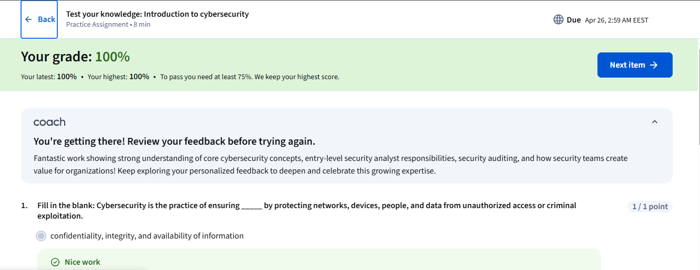
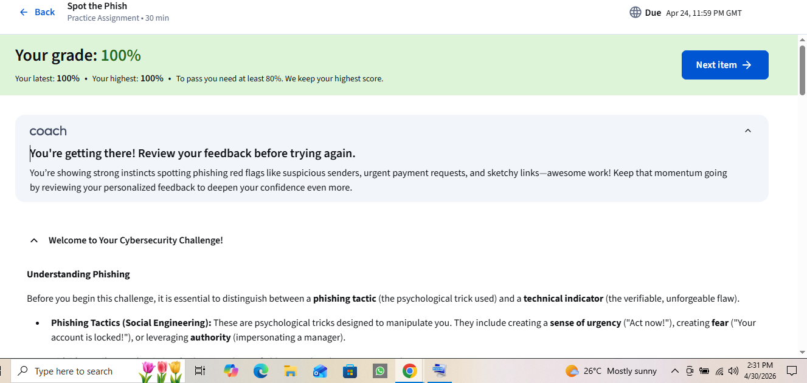

# Module 1: Introduction to Cybersecurity

### 📝 Summary of Learning
This week, I successfully completed the introduction to the Google Cybersecurity program. I explored the core terminology that every professional must know.

### 🛡️ Technical Concepts Mastered
* **The CIA Triad:**
    * **Confidentiality:** Ensuring only authorized users access data.
    * **Integrity:** Ensuring data remains accurate and unaltered.
    * **Availability:** Ensuring data is accessible when needed.
* **Social Engineering:** Learned to identify "Phishing" attacks by looking for urgent language and suspicious sender addresses.

### 🎯 Practice Performance
I achieved **100%** on my first two assignments.

**Spot the Phish Analysis:**
In this exercise, I acted as the first line of defense, identifying malicious emails. This skill is critical for my future startup to help train employees in small businesses.

### 📸 Proof of Achievement

